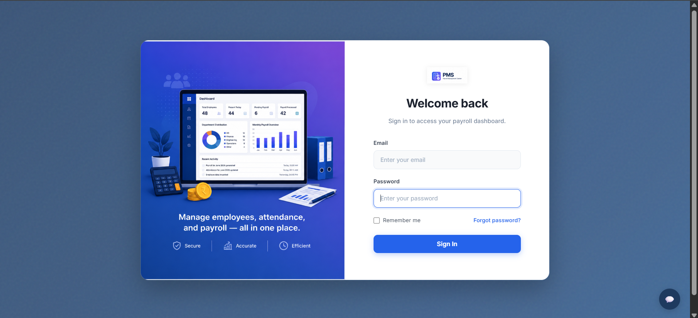
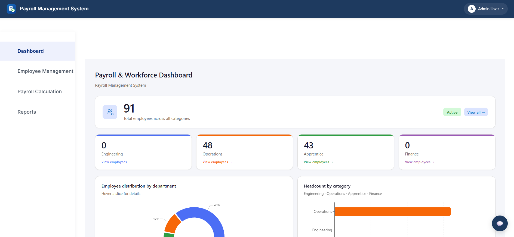
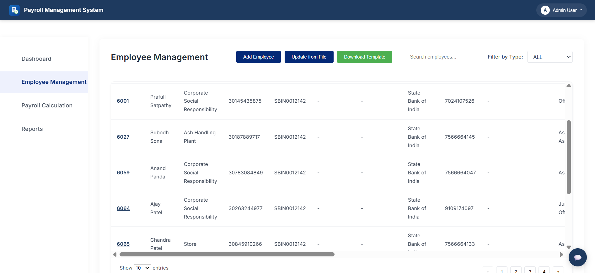
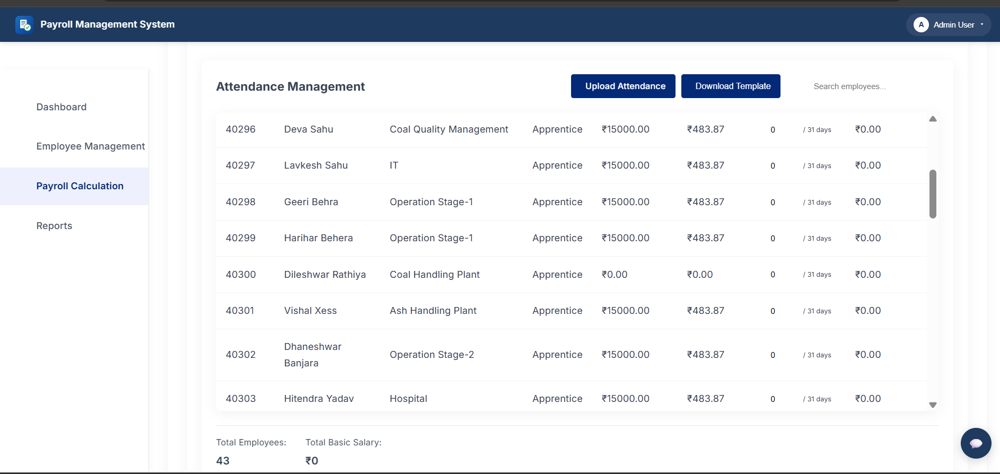
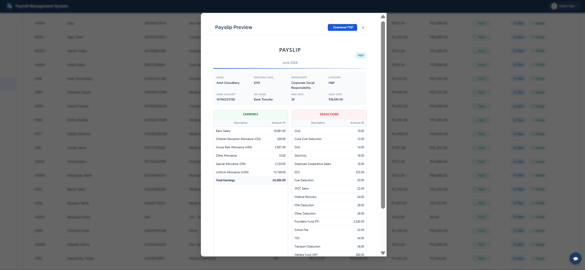
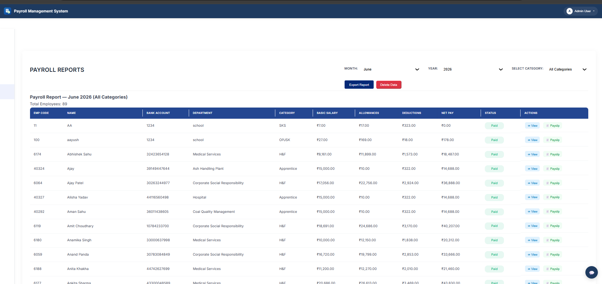

# 💼 Payroll Management System

A full-stack web-based **Payroll Management System** built to manage employees, attendance, salaries, payroll processing, and reports through a centralized application.

The system uses a **React.js frontend**, **Node.js + Express.js backend**, and **MySQL database**, with REST APIs connecting the frontend and backend.

---

## 📸 Application Screenshots

Screenshots will be added here to showcase the application's main modules.

### 🔐 Login



### 📊 Dashboard



### 👨‍💼 Employee Management



### 🕐 Attendance Management



### 💰 Payroll & Salary Management



### 📑 Reports



---

## ✨ Features

### 🔐 Authentication & Security

* User login and authentication
* JWT-based authentication
* Password hashing with bcrypt
* Protected backend routes
* Request validation

### 👨‍💼 Employee Management

* Add and manage employee information
* Employee records
* Employee-related payroll data
* REST API integration

### 🕐 Attendance Management

* Attendance tracking
* Attendance-related employee records
* Backend API support for attendance operations

### 💰 Payroll & Salary Management

* Salary management
* Payroll processing
* Employee salary information
* Payroll-related calculations and records

### 📊 Dashboard & Reports

* Dashboard data visualization
* Charts and graphical data representation
* Payroll reports
* Report generation

### 📄 Export & Documents

* PDF generation
* PDF tables using jsPDF AutoTable
* Spreadsheet export using XLSX

### 🎨 User Interface

* React-based interface
* Responsive styling
* Toast notifications
* React Icons
* Client-side routing

---

## 🛠️ Technology Stack

| Layer              | Technologies           |
| ------------------ | ---------------------- |
| Frontend           | React.js 19            |
| Routing            | React Router           |
| API Communication  | Axios                  |
| UI / Styling       | CSS, Tailwind CSS      |
| Charts             | Chart.js, Recharts     |
| Backend            | Node.js, Express.js    |
| Authentication     | JWT, bcrypt            |
| Validation         | Express Validator      |
| Database           | MySQL                  |
| Database Driver    | mysql2                 |
| PDF Generation     | jsPDF, jsPDF AutoTable |
| Spreadsheet Export | XLSX                   |
| Notifications      | React Toastify         |
| Version Control    | Git, GitHub            |

---

## 🏗️ System Architecture

```text
                    ┌──────────────────────┐
                    │      React.js        │
                    │      Frontend        │
                    └──────────┬───────────┘
                               │
                               │ REST API
                               ▼
                    ┌──────────────────────┐
                    │   Node.js / Express  │
                    │       Backend        │
                    └──────────┬───────────┘
                               │
                     ┌─────────┴─────────┐
                     │                   │
                     ▼                   ▼
              Authentication        Business Logic
                     │                   │
                     └─────────┬─────────┘
                               │
                               ▼
                    ┌──────────────────────┐
                    │        MySQL         │
                    │       Database       │
                    └──────────────────────┘
```

---

## 📂 Project Structure

```text
PAY/
│
├── payroll-app/
│   │
│   ├── public/
│   ├── src/
│   │   ├── assets/
│   │   ├── components/
│   │   ├── context/
│   │   ├── hooks/
│   │   ├── services/
│   │   ├── styles/
│   │   ├── App.js
│   │   ├── App.css
│   │   └── index.js
│   │
│   ├── package.json
│   └── .env
│
├── payroll-backend/
│   │
│   ├── config/
│   ├── middleware/
│   ├── migrations/
│   ├── models/
│   ├── routes/
│   │   ├── attendance.js
│   │   ├── auth.js
│   │   ├── employees.js
│   │   ├── payrollRoutes.js
│   │   ├── reports.js
│   │   ├── salaries.js
│   │   └── salary.js
│   │
│   ├── scripts/
│   ├── db.js
│   ├── server.js
│   └── package.json
│
├── logo.png
├── styles.css
├── package.json
├── package-lock.json
├── .gitignore
└── README.md
```

---

## ⚙️ Getting Started

### Prerequisites

Make sure the following are installed:

* Node.js
* npm
* MySQL
* Git

---

### 1. Clone the Repository

```bash
git clone https://github.com/yash77258-pro/payroll-management-system.git
```

Navigate into the project:

```bash
cd payroll-management-system
```

---

### 2. Configure the Database

Create the required MySQL database and configure the backend database connection.

Database configuration should be stored in environment variables.

Example:

```env
DB_HOST=localhost
DB_USER=your_username
DB_PASSWORD=your_password
DB_NAME=payroll
DB_PORT=3306
```

> Never commit real database passwords or other secrets to GitHub.

---

### 3. Install Backend Dependencies

```bash
cd payroll-backend
npm install
```

Start the backend:

```bash
npm start
```

For development:

```bash
npm run dev
```

---

### 4. Install Frontend Dependencies

Open another terminal:

```bash
cd payroll-app
npm install
```

Start the React application:

```bash
npm start
```

The frontend will normally be available through the React development server.

---

## 🔌 Backend API Modules

The backend is organized into separate route modules:

```text
/auth
/employees
/attendance
/payroll
/reports
/salaries
```

The exact endpoint paths and request formats depend on the route configuration in the backend.

---

## 🔒 Security

The application includes several security-related mechanisms:

* JWT authentication
* Password hashing
* Protected routes
* Authentication middleware
* Request validation
* Environment-based configuration

Sensitive configuration should remain outside the Git repository.

---

## 📊 Reporting & Data Visualization

The frontend includes charting and reporting functionality using:

* Chart.js
* Recharts
* jsPDF
* jsPDF AutoTable
* XLSX

These libraries allow payroll and employee-related information to be visualized and exported into useful formats.

---

## 🎯 Project Objectives

The project was developed to demonstrate practical full-stack development concepts including:

* Frontend application development
* REST API development
* Authentication and authorization
* Database integration
* CRUD operations
* Payroll and salary management
* Data visualization
* Report generation
* Git and GitHub workflow

---

## 🔮 Future Improvements

Potential improvements include:

* Role-based access control
* Automated payslip generation
* Email notifications
* Advanced payroll analytics
* Cloud deployment
* Automated testing
* Docker-based deployment
* Improved mobile experience

---

## 👨‍💻 Author

### Yash Gohar

**BCA | Full-Stack Developer**

Interested in:

* Full-Stack Web Development
* React.js
* Node.js
* Express.js
* MySQL
* REST APIs
* Docker & Deployment

---

## 📌 Project Status

**Status:** Active portfolio project

The project can be further extended with additional payroll automation, reporting, authentication, and deployment features.

---

## ⭐ If you find this project useful

Feel free to explore the source code and learn from the implementation.
